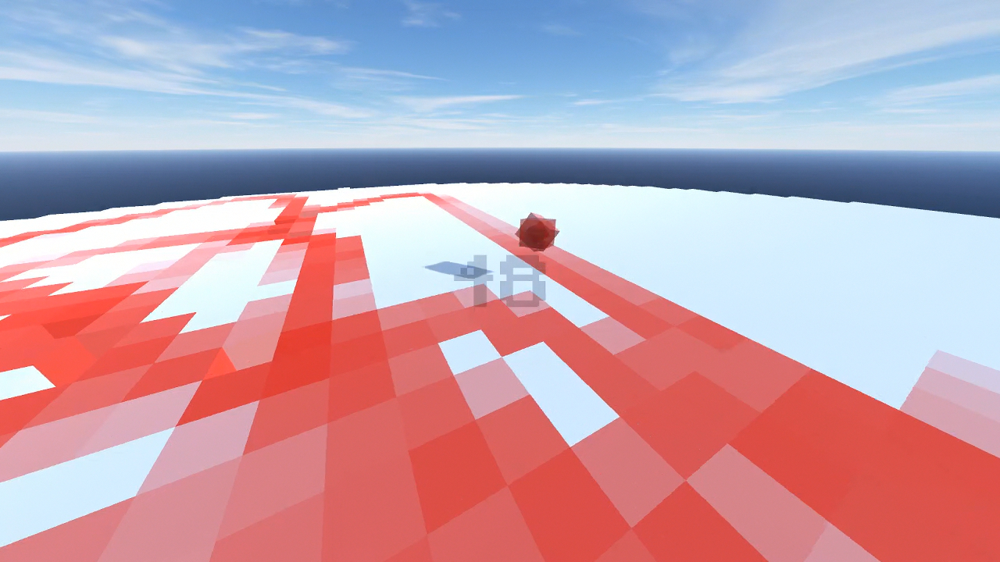
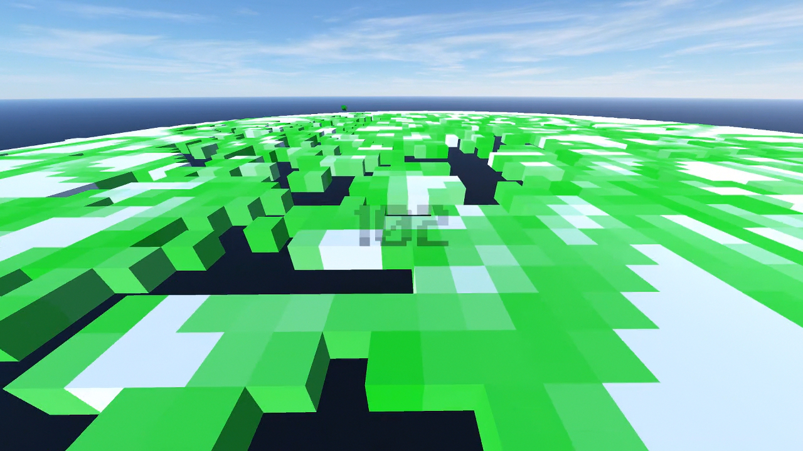
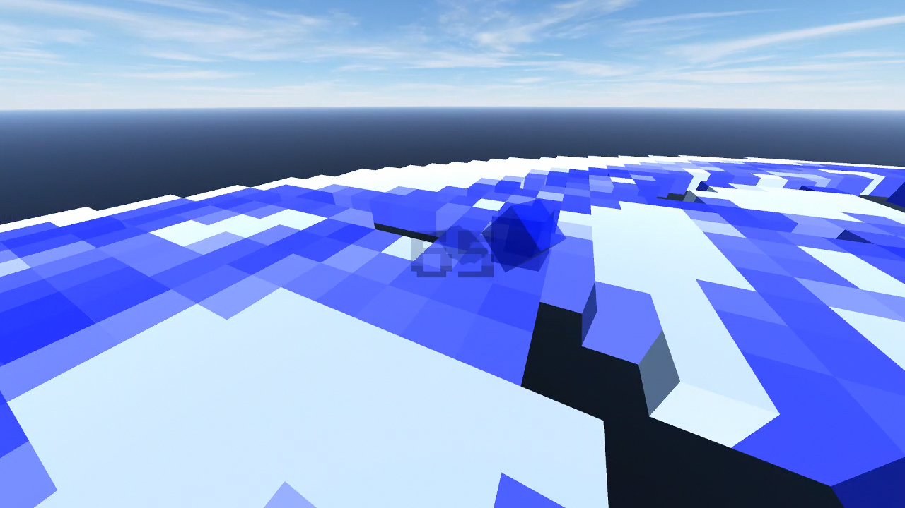

# FloorRun
Simple game i made in Unity with C# for Windows a long time ago. The objective is to survive as long as possible as you collect orbs which give you time while the floor crumbles beneath you.
Project is too big for github so i can't upload it. I have added only some scripts.

**Floor Run 1.0.7z** is the full working release.

